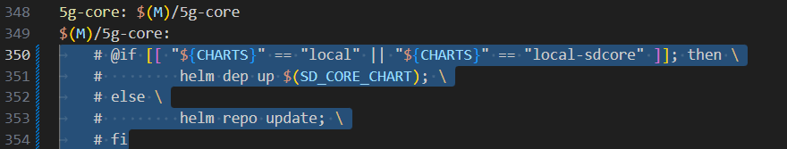
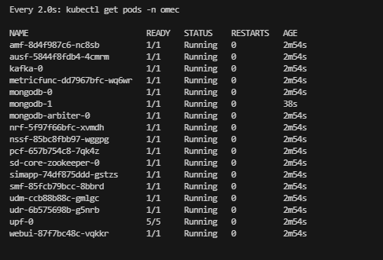

# Local SD-Core Helm Charts 
Helm charts for the Sdcore deployment. This contains both control plane and user plane network functions

# Testing sd-core-helm-charts locally

1. Clone the repo 
```
git clone https://github.com/NgKore47/sdcore-helm-charts
```
> **Note:** See the git diff [here](./patch/sdcore-helm-charts.patch)

2. Move `cord` to home directory:
```bash
cd ~/sdcore-helm-charts/
cp -r cord/ ~/
```

>**NOTE:** Make sure that the `sd-core-helm-charts` folder is present at this path `/home/ubuntu/core/sd-core-helm-charts`
```bash
#cd cord/sdcore-helm-charts/sdcore-helm-charts/
#helm dependency build   # or [helm dep update] to Update Helm dependencies
```


3. Clone Aether-in-a-Box

```bash
cd ~
git clone https://github.com/NgKore47/SD-Core.git
cd ~/SD-Core
rm sd-core-5g-values.yaml
cp ~/sdcore-helm-charts/sd-core-5g-values.yaml .
sudo apt install make
make node-prep

# pull ngkore docker private images
kubectl create secret docker-registry regcred --docker-server=https://index.docker.io/v1/ --docker-username=ngkore --docker-password=dckr_pat_YpE3gKTQhmnQtk4vnT3y0OhoZHI --docker-email=ngkore47@gmail.com

kubectl create -f ~/sdcore-helm-charts/private-docker-images.yml
```

Before running `5g-core`, comment out these lines in Makefile of `SD-Core`:



```
# Wait for few seconds to pull ngkore images
ENABLE_GNBSIM=false CHARTS=local DATA_IFACE=eth0 make 5g-core
```

> **Note:** You can also see the difference between this `sd-core-5g-values.yaml` and the default one [here](./patch/aether-in-a-box.patch)


8. To verify the installation:

```bash
kubectl get pods -n omec 
```



